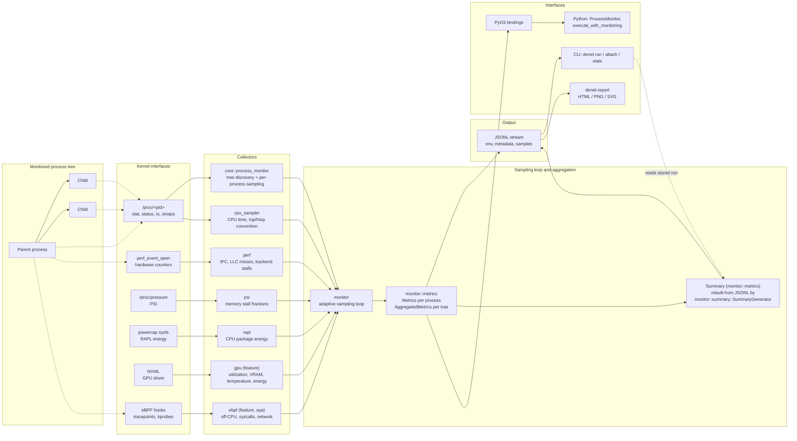

# Architecture

How a sample travels from the monitored process to the metrics you consume.

## Data flow



## Stages

**Process tree discovery.** `core::process_monitor` resolves the target — either a command denet launched (`run`) or an existing PID (`attach`) — and re-walks its descendants on every tick, so processes spawned mid-run are picked up. Child tracking can be switched off with `--exclude-children`.

**Collection.** Each collector is independent and degrades on its own. `/proc` sampling and `cpu_sampler` are the baseline and need no privileges. `perf`, `psi` and `rapl` are Linux-only and yield nothing when the kernel interface is restricted or absent. `gpu` and `ebpf` are compile-time features: `gpu` needs NVML, `ebpf` needs a kernel with `CONFIG_BPF_SYSCALL` and `CAP_BPF`. A collector that cannot read its source contributes no fields rather than failing the run.

**Adaptive sampling.** The loop starts at the base interval (default 100 ms) to resolve startup and transient spikes, then relaxes linearly over the next nine seconds toward the maximum interval (default 1000 ms), staying there for long-running processes. Both bounds are user-set (`-i`, `-m`); a fixed rate is just `-i` equal to `-m`.

**Aggregation.** `monitor::metrics` holds two levels: `Metrics` per process, and `AggregatedMetrics` summed across the tree with thread counts de-duplicated. `Summary` is the terminal roll-up — peaks, totals, averages, and the optional GPU, syscall and memory-characterization blocks.

**Output.** One JSONL stream: an optional `env` record (host, NUMA, affinity) with `--write-env`, then a metadata line, then one line per sample. Because records are emitted as they are taken, the stream is readable while the run is in progress.

**Interfaces.** The CLI wraps or attaches, and `denet stats` rebuilds a `Summary` from a stored JSONL file via `monitor::summary::SummaryGenerator` — that reconstruction is derived purely from the recorded samples, so it produces identical output on a machine that has no GPU. The PyO3 bindings expose the same monitor to Python, and `denet-report` renders a stored run to HTML, PNG or SVG.

## Rendering this diagram

GitHub renders the Mermaid block above directly. To produce a static copy:

```bash
npx --yes @mermaid-js/mermaid-cli -i docs/architecture.md -o docs/architecture.svg
```
